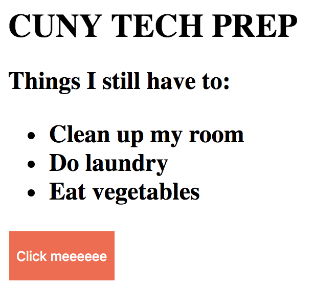

# cuny-tech-interview


This repository contains code for the "Build a reminder notification" question. 
You've got a TODO list but you really don't want to do those things. So you click 
a button that says `Remind me after 3 days`. For some reason, 3 days is right?




Design a way such that an alert or confirmation is made on the page 
that it's time to do those TODO items

Submit your solution as a pull request for review. 

## Run the server 

`python server.py`

After running the server, you should see the following output in your terminal:

```
CUNY TECH PREP interview question is serving at port 8000
navigate to http://localhost:8000
```